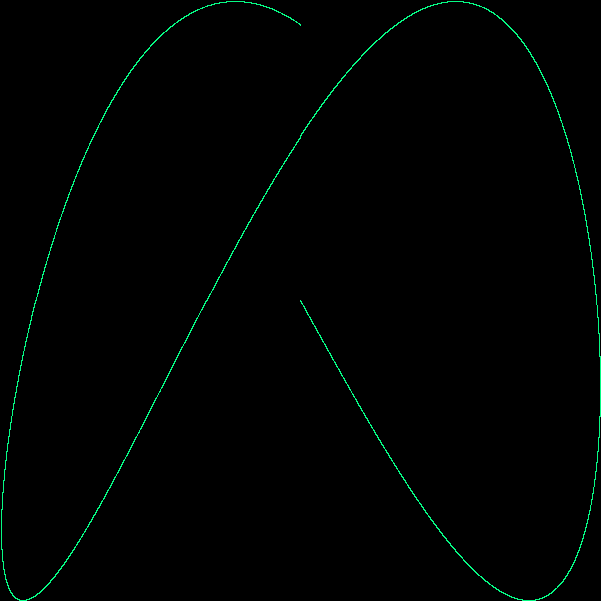
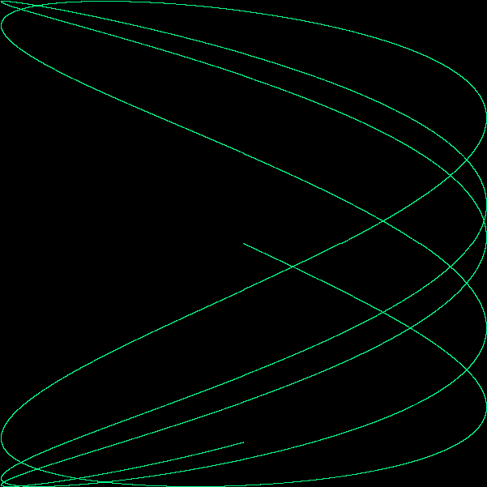

# Lissajous Curves

This program demonstrates basic usage of Go’s standard image packages, which we’ll use to create a sequence of bit-mapped images and then encode the sequence as a GIF animation. The images, called Lissajous figures, were a staple visual effect in sci-fi films of the 1960s.

[Demo 1](https://sleepy-shelf-34750.herokuapp.com)

[Demo 2](https://sleepy-shelf-34750.herokuapp.com/?cycles=5)
